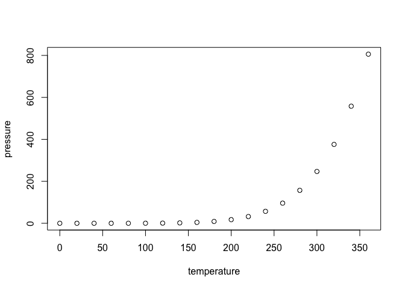

<!-- README.md is generated from README.Rmd. Please edit that file -->

# dhtk

<!-- badges: start -->

[](https://travis-ci.com/Jpowell94/dhtk)
<!-- badges: end -->

## Overview

The goal of dhtk is to provide a collection of functions meant to ease
general DH work. It is meant to be used along side various other text
mining/ corpus linguistics tools, and to make using these other tools
easier and more expedient. The packages it is intended to work along
side at the moment include:

  - [tm](https://cran.r-project.org/web/packages/tm/vignettes/tm.pdf)
  - [topicmodels](https://cran.r-project.org/web/packages/topicmodels/vignettes/topicmodels.pdf)
  - [LDAvis](https://github.com/cpsievert/LDAvis)

## Installation

You can install dhtk from [Github](https://github.com) with:

``` r
devtools::install_github("Jpowell94/dhtk")
```

## Usage

dhtk allows you to work *smarter*. Make use of already existing tools in
your DH projects with ease and by writing fewer lines of code to get
your results.

``` r
library(dhtk)
## basic example code
```

What is special about using `README.Rmd` instead of just `README.md`?
You can include R chunks like so:

``` r
summary(cars)
#>      speed           dist       
#>  Min.   : 4.0   Min.   :  2.00  
#>  1st Qu.:12.0   1st Qu.: 26.00  
#>  Median :15.0   Median : 36.00  
#>  Mean   :15.4   Mean   : 42.98  
#>  3rd Qu.:19.0   3rd Qu.: 56.00  
#>  Max.   :25.0   Max.   :120.00
```

You’ll still need to render `README.Rmd` regularly, to keep `README.md`
up-to-date.

You can also embed plots, for example:



In that case, don’t forget to commit and push the resulting figure
files, so they display on GitHub\!
